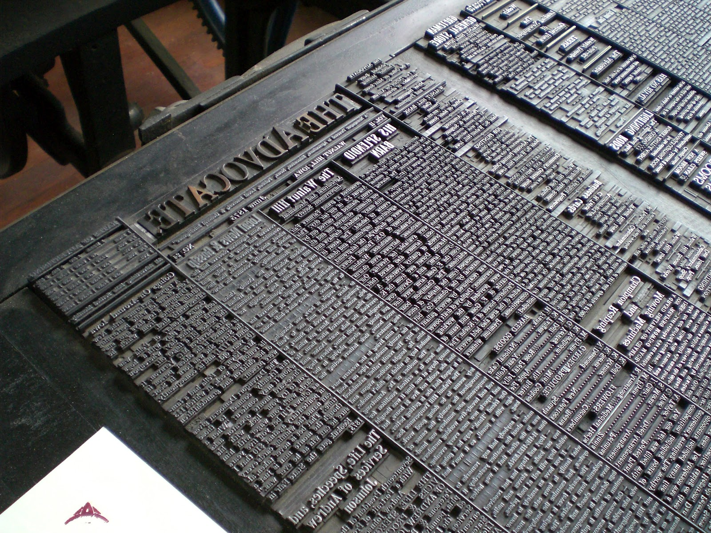
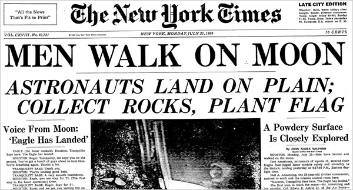
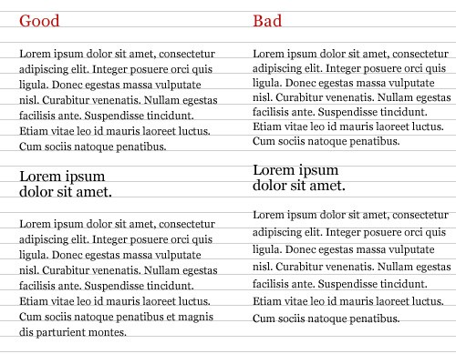
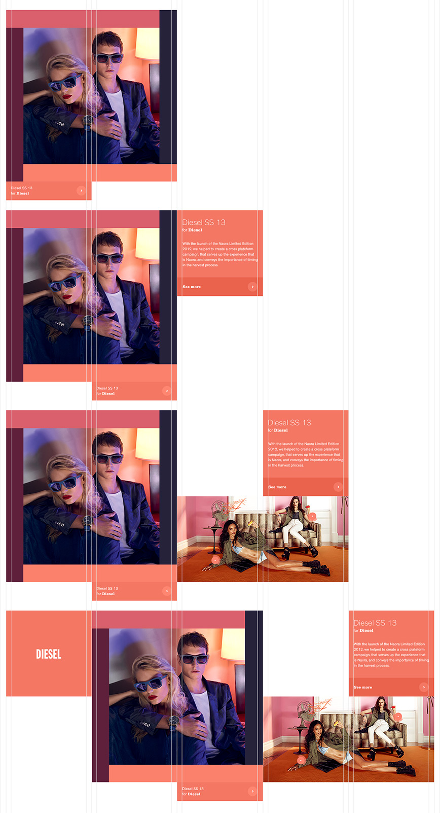

# Web Typography 101

### Objectives

1. Go over how to convert, download, & host your own fonts
2. Using CSS to make type easier to read
    - The concept of the font stack
    - Serif, sans-serif, cursive, fantasy, monospace
    - Letter-spacing
    - Large fonts in featured places
    - Type and imagery
3. What *is* typogrpahy, anyway?
4. Type Choice 101
    - Choosing typefaces and using them judiciously (mixing serif and sans-serif)
    - Font pairing
    - How to match serifs and sans-serifs
    - When to use decorative fonts & how to choose them judiciously
5. Some typography examples
    - Healthify vs Northport Nutrition (voice)

## What is typography?

### At the most basic explanation - typography is the design and use of typefaces as a means of communication.

- Here is a good article: [What is typography?](https://www.thoughtco.com/basic-typography-terminology-1697697)
- A particularly good part: "Look at each block of text as though it had no words in it. What shapes does the text make on the page? Make sure those shapes carry the entire page design forward."
- At its base, typography is a way to get across information on the page. But, it's also a design element of the page. The type you choose communicates the design of your product just as much as imagery, color choice, wording, etc.

## Type Choice 101

### Grid

Print layouts influence web type, as many early designers came from print and started designing for web. Many sites still use the grid layout.

This is sort of where grid systems like bootstrap and so on came from -- designing in a grid is natural and efficient for typograpers handling presses that are set up for it. [Example site](http://on-hybrids.eli-block.com/)

In some ways the web is moving towards a more postmodern understanding of the grid. Instead of saying, "Oh, here is a page, here is the grid we use to arrange the page", the thought process is more along the lines of "Here are elements in a configuration that is assembled and reassembled as needed to account for different screen sizes."

Describing the web as "an edgeless surface of unknown proportions comprised of small, individual, and variable elements from multiple vantages assembled into a readable whole that documents a moment." [from fantastic article The Web's Grain](https://frankchimero.com/writing/the-webs-grain/)

Anyway, this is all getting a little abstract.

### Scale

One of the ways to manage the grid is with type scales. The most common type scale is 48, 36, 24, 21, 18, 16, 14 -- non-linear.

### Pairing 101

[Adapted from this article](http://blog.invisionapp.com/how-to-pair-fonts/)

- Provides contrast & emphasis without having to add additional elements or change colors & so on
- Gives options for bdoy & headline depending on what's more appropriate for the situation
- The tried & tested concept for this is to pick a serif font and a sans-serif font, since pairing those two is easier.
- Dangers of picking two serifs or two sans -- take a look at [adobe lists](https://typekit.com/lists)
- [example one](http://rhcbooks.com/), [example two](http://esknoxville.org/), [example three](http://a-l-a-a.com/)

### Anatomy of a Typeface

[Here is a detailed resource.](http://typedia.com/learn/only/anatomy-of-a-typeface)

[Codepen link](http://codepen.io/jlr7245/pen/OpgevB)

### Pairing 201

- Pairing more than two typefaces
- go into healthify type choices & the roles for each -- consistency in font roles
- Creating a visual language for information hierarcy so a viewer can see at a glance what's going on
- Making sure fonts have similar characteristics -- same x-height, etc. -- even if they have very different looks & feels.
- Here are some great examples: [example one](https://news.northeastern.edu/), [example 2](https://www.thebureauinvestigates.com/), 
- Sometimes it can work when there's just one typeface: [example one](http://eastroom.ca/#membership), [example two](https://www.offscreenmag.com/), [example three](https://semaphoreci.com/)

### When to use or not use decorative fonts

- Decorative fonts should only be used for emphasis when necessary.
- Show profilepro example
- But sometimes sites can use decorative type and it fits the voice. For example: [http://enchantments.guide/](http://enchantments.guide/)

## Talk some about voice in typography here!

[third health site](http://www.boweryfarming.com/)

## Accessibility 

[dyslexic friendly typeface](http://opendyslexic.org/)

[chrome extension](https://chrome.google.com/webstore/detail/opendyslexic/cdnapgfjopgaggbmfgbiinmmbdcglnam?hl=en)